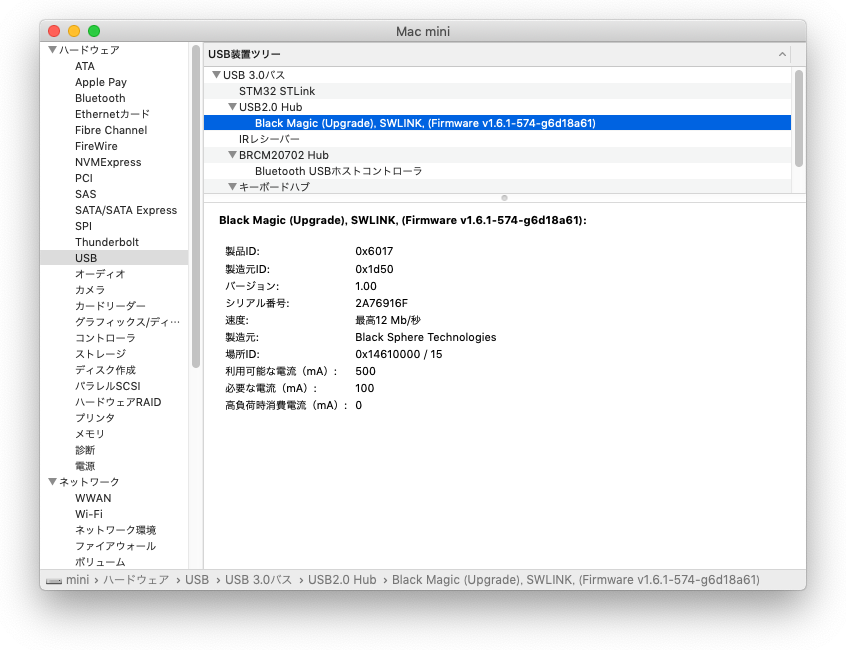
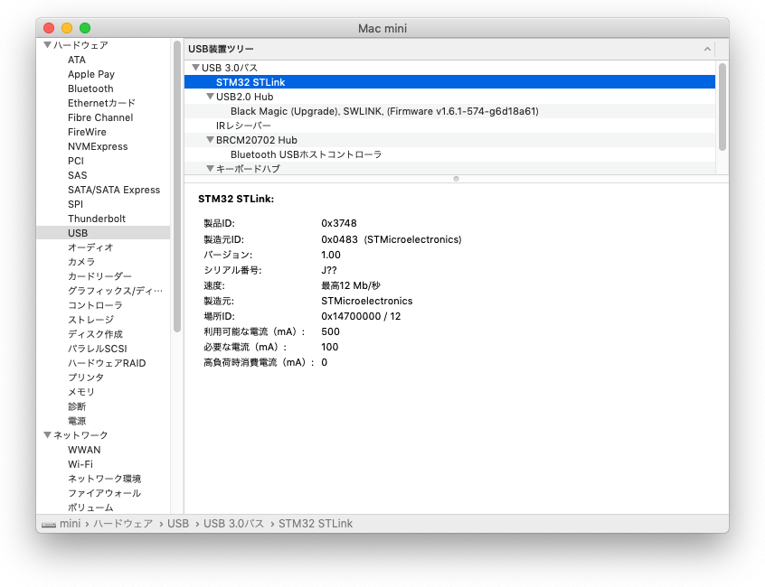

# BluePill破壊？

新品のBluePillにblackmagic_dfu.binとblackmagic.binをst-flashで書き込んだ
（[詳細](install.md）ところ、BluePillが以下のように読めなくなった。Windowsで
動くST製の`STM32 ST-LINK Utility`でも同様で、設定を変えても認識しない。

## 読めるBluePill

```
dspace@mini:~$ st-info --probe
Found 1 stlink programmers
 serial:     4a1a16002c135737334d4e00
 hla-serial: "\x4a\x1a\x16\x00\x2c\x13\x57\x37\x33\x4d\x4e\x00"
 flash:      65536 (pagesize: 1024)
 sram:       20480
 chipid:     0x0410
 descr:      F1xx Medium-density
dspace@mini:~$
```

## 読めないBluePill

```
dspace@mini:~$ st-info --probe
Found 1 stlink programmers
 serial:     4a1a16002c135737334d4e00
 hla-serial: "\x4a\x1a\x16\x00\x2c\x13\x57\x37\x33\x4d\x4e\x00"
 flash:      0 (pagesize: 0)
 sram:       0
 chipid:     0x0748

dspace@mini:~$ st-flash --debug erase
st-flash 1.6.1
2020-09-16T08:58:51 DEBUG common.c: *** looking up stlink version
2020-09-16T08:58:51 DEBUG common.c: st vid         = 0x0483 (expect 0x0483)
2020-09-16T08:58:51 DEBUG common.c: stlink pid     = 0x3748
2020-09-16T08:58:51 DEBUG common.c: stlink version = 0x2
2020-09-16T08:58:51 DEBUG common.c: jtag version   = 0x22
2020-09-16T08:58:51 DEBUG common.c: swim version   = 0x7
2020-09-16T08:58:51 DEBUG common.c: *** looking up stlink version
2020-09-16T08:58:51 DEBUG common.c: st vid         = 0x0483 (expect 0x0483)
2020-09-16T08:58:51 DEBUG common.c: stlink pid     = 0x3748
2020-09-16T08:58:51 DEBUG common.c: stlink version = 0x2
2020-09-16T08:58:51 DEBUG common.c: jtag version   = 0x22
2020-09-16T08:58:51 DEBUG common.c: swim version   = 0x7
2020-09-16T08:58:51 DEBUG common.c: stlink current mode: mass
2020-09-16T08:58:51 DEBUG usb.c: JTAG/SWD freq set to 0
2020-09-16T08:58:51 DEBUG common.c: *** set_swdclk ***
2020-09-16T08:58:51 DEBUG common.c: stlink current mode: mass
2020-09-16T08:58:51 DEBUG common.c: *** stlink_enter_swd_mode ***
2020-09-16T08:58:51 DEBUG common.c: *** stlink_jtag_reset ***
2020-09-16T08:58:51 DEBUG common.c: *** stlink_reset ***
2020-09-16T08:58:51 DEBUG common.c: *** stlink_write_debug32 5fa0004 to 0xe000ed0c
2020-09-16T08:58:51 DEBUG common.c: Loading device parameters....
2020-09-16T08:58:51 DEBUG common.c: *** stlink_core_id ***
2020-09-16T08:58:51 DEBUG common.c: core_id = 0x00003748
2020-09-16T08:58:51 DEBUG common.c: *** stlink_read_debug32 3748 is 0xe0042000
2020-09-16T08:58:51 WARN common.c: unknown chip id! 0x3748
Failed to connect to target
```

## フラッシュを全クリアして復活

`STM32 ST-LINK Utility`においてBluePillをつないだST-LINKをBluePillのリセット
ボタンを押しながら挿入したところ認識したので、フラッシュを全エリアクリアした。すると
以下の通り、BluePillが見えるようになった。

```
dspace@mini:~$ st-info --probe
Found 1 stlink programmers
 serial:     4a1a16002c135737334d4e00
 hla-serial: "\x4a\x1a\x16\x00\x2c\x13\x57\x37\x33\x4d\x4e\x00"
 flash:      65536 (pagesize: 1024)
 sram:       20480
 chipid:     0x0410
 descr:      F1xx Medium-density

dspace@mini:~$ st-flash --debug erase
st-flash 1.6.1
2020-09-16T10:03:20 DEBUG common.c: *** looking up stlink version
2020-09-16T10:03:20 DEBUG common.c: st vid         = 0x0483 (expect 0x0483)
2020-09-16T10:03:20 DEBUG common.c: stlink pid     = 0x3748
2020-09-16T10:03:20 DEBUG common.c: stlink version = 0x2
2020-09-16T10:03:20 DEBUG common.c: jtag version   = 0x22
2020-09-16T10:03:20 DEBUG common.c: swim version   = 0x7
2020-09-16T10:03:20 DEBUG common.c: *** looking up stlink version
2020-09-16T10:03:20 DEBUG common.c: st vid         = 0x0483 (expect 0x0483)
2020-09-16T10:03:20 DEBUG common.c: stlink pid     = 0x3748
2020-09-16T10:03:20 DEBUG common.c: stlink version = 0x2
2020-09-16T10:03:20 DEBUG common.c: jtag version   = 0x22
2020-09-16T10:03:20 DEBUG common.c: swim version   = 0x7
2020-09-16T10:03:20 DEBUG common.c: stlink current mode: debug (jtag or swd)
2020-09-16T10:03:20 DEBUG usb.c: JTAG/SWD freq set to 0
2020-09-16T10:03:20 DEBUG common.c: *** set_swdclk ***
2020-09-16T10:03:20 DEBUG common.c: stlink current mode: debug (jtag or swd)
2020-09-16T10:03:20 DEBUG common.c: *** stlink_jtag_reset ***
2020-09-16T10:03:20 DEBUG common.c: *** stlink_reset ***
2020-09-16T10:03:20 DEBUG common.c: *** stlink_write_debug32 5fa0004 to 0xe000ed0c
2020-09-16T10:03:20 DEBUG common.c: Loading device parameters....
2020-09-16T10:03:20 DEBUG common.c: *** stlink_core_id ***
2020-09-16T10:03:20 DEBUG common.c: core_id = 0x2ba01477
2020-09-16T10:03:20 DEBUG common.c: *** stlink_read_debug32 20036410 is 0xe0042000
2020-09-16T10:03:20 DEBUG common.c: *** stlink_read_debug32 ffff0040 is 0x1ffff7e0
2020-09-16T10:03:20 INFO common.c: F1xx Medium-density: 20 KiB SRAM, 64 KiB flash in at least 1 KiB pages.
2020-09-16T10:03:20 DEBUG common.c: stlink current mode: debug (jtag or swd)
2020-09-16T10:03:20 DEBUG common.c: stlink current mode: debug (jtag or swd)
2020-09-16T10:03:20 DEBUG common.c: *** stlink_force_debug_mode ***
2020-09-16T10:03:20 DEBUG common.c: *** stlink_status ***
2020-09-16T10:03:20 DEBUG usb.c: core status: 00030003
2020-09-16T10:03:20 DEBUG common.c:   core status: halted
2020-09-16T10:03:20 DEBUG common.c: *** stlink_read_debug32 0 is 0x4002200c
2020-09-16T10:03:20 DEBUG common.c: *** stlink_read_debug32 80 is 0x40022010
2020-09-16T10:03:20 DEBUG common.c: *** stlink_write_debug32 45670123 to 0x40022004
2020-09-16T10:03:20 DEBUG common.c: *** stlink_write_debug32 cdef89ab to 0x40022004
2020-09-16T10:03:20 DEBUG common.c: *** stlink_read_debug32 0 is 0x40022010
2020-09-16T10:03:20 DEBUG common.c: Successfully unlocked flash
2020-09-16T10:03:20 DEBUG common.c: *** stlink_read_debug32 0 is 0x40022010
2020-09-16T10:03:20 DEBUG common.c: *** stlink_write_debug32 4 to 0x40022010
2020-09-16T10:03:20 DEBUG common.c: *** stlink_read_debug32 4 is 0x40022010
2020-09-16T10:03:20 DEBUG common.c: *** stlink_write_debug32 44 to 0x40022010
Mass erasing2020-09-16T10:03:20 DEBUG common.c: *** stlink_read_debug32 1 is 0x4002200c
2020-09-16T10:03:20 DEBUG common.c: *** stlink_read_debug32 1 is 0x4002200c
2020-09-16T10:03:20 DEBUG common.c: *** stlink_read_debug32 1 is 0x4002200c
2020-09-16T10:03:20 DEBUG common.c: *** stlink_read_debug32 20 is 0x4002200c

2020-09-16T10:03:20 DEBUG common.c: *** stlink_read_debug32 20 is 0x4002200c
2020-09-16T10:03:20 DEBUG common.c: *** stlink_read_debug32 4 is 0x40022010
2020-09-16T10:03:20 DEBUG common.c: *** stlink_write_debug32 84 to 0x40022010
2020-09-16T10:03:20 DEBUG common.c: *** stlink_read_debug32 84 is 0x40022010
2020-09-16T10:03:20 DEBUG common.c: *** stlink_write_debug32 80 to 0x40022010
2020-09-16T10:03:20 DEBUG common.c: *** stlink_exit_debug_mode ***
2020-09-16T10:03:20 DEBUG common.c: *** stlink_write_debug32 a05f0000 to 0xe000edf0
2020-09-16T10:03:20 DEBUG common.c: *** stlink_close ***
```

# BluePill復活を確認

## ST-LINKと[stlink](https://github.com/stlink-org/stlink)を使って書き込み

ST-LINK V2はopenocdからは使えないみたい（`interface/stlink-v2.cfg`は正規商品用で
`hla_vid_pid`がST-LINK V2のものとは違う）でopenocdがエラーで立ち上がらなかった。そこで
stlinkのst-utilを使って書き込みを行ったところ、うまく行った。

1. 端末AでGDBサーバを立ち上げる
    ```
    $ st-util
    ```

2. 端末Bでgdbを立ち上げる

    ```
    $ cd target/thumbv7m-none-eabi/debug/examples
    $ gdb blinky
    GNU gdb (GDB) 9.2
    ...
    Reading symbols from blinky...
    (gdb) target extended-remote :4242
    Remote debugging using :4242
    0x00000000 in ?? ()
    (gdb) load
    Loading section .vector_table, size 0x130 lma 0x8000000
    Loading section .text, size 0x28d0 lma 0x8000130
    Loading section .rodata, size 0x724 lma 0x8002a00
    Start address 0x08000130, load size 12580
    Transfer rate: 16 KB/sec, 4193 bytes/write.
    ```

## `st-flash`で書き込む

`st-flash`で書き込む場合、ELF形式のファイルをBIN形式に変換する必要がある。

```
$ arm-none-eabi-objcopy -O binary blinky blinky.bin
$ st-flash write blinky.bin 0x8000000
st-flash 1.6.1
2020-09-16T10:41:12 INFO common.c: F1xx Medium-density: 20 KiB SRAM, 64 KiB flash in at least 1 KiB pages.
file blinky.bin md5 checksum: a776c779de16d57c1c9a1648ab9c896d, stlink checksum: 0x00144183
2020-09-16T10:41:12 INFO common.c: Attempting to write 12580 (0x3124) bytes to stm32 address: 134217728 (0x8000000)
2020-09-16T10:41:12 INFO common.c: Flash page at addr: 0x08000000 erased
2020-09-16T10:41:12 INFO common.c: Flash page at addr: 0x08000400 erased
2020-09-16T10:41:12 INFO common.c: Flash page at addr: 0x08000800 erased
2020-09-16T10:41:12 INFO common.c: Flash page at addr: 0x08000c00 erased
2020-09-16T10:41:12 INFO common.c: Flash page at addr: 0x08001000 erased
2020-09-16T10:41:12 INFO common.c: Flash page at addr: 0x08001400 erased
2020-09-16T10:41:12 INFO common.c: Flash page at addr: 0x08001800 erased
2020-09-16T10:41:12 INFO common.c: Flash page at addr: 0x08001c00 erased
2020-09-16T10:41:12 INFO common.c: Flash page at addr: 0x08002000 erased
2020-09-16T10:41:12 INFO common.c: Flash page at addr: 0x08002400 erased
2020-09-16T10:41:12 INFO common.c: Flash page at addr: 0x08002800 erased
2020-09-16T10:41:12 INFO common.c: Flash page at addr: 0x08002c00 erased
2020-09-16T10:41:12 INFO common.c: Flash page at addr: 0x08003000 erased
2020-09-16T10:41:12 INFO common.c: Finished erasing 13 pages of 1024 (0x400) bytes
2020-09-16T10:41:12 INFO common.c: Starting Flash write for VL/F0/F3/F1_XL core id
2020-09-16T10:41:12 INFO flash_loader.c: Successfully loaded flash loader in sram
13/13 pages written
2020-09-16T10:41:12 INFO common.c: Starting verification of write complete
2020-09-16T10:41:12 INFO common.c: Flash written and verified! jolly good!
```

これでBluePillが購入時の状態に戻ったことがわかった。そこで、BlackMagic化に再挑戦することにした。

# BlackMagic化に再挑戦

## bootloader (blackmagic_dfu.bin)の書き込み => 成功

```
dspace@mini:~/source/blackmagic/src$ st-flash write blackmagic_dfu.bin 0x8000000
st-flash 1.6.1
2020-09-16T16:55:54 INFO common.c: F1xx Medium-density: 20 KiB SRAM, 64 KiB flash in at least 1 KiB pages.
file blackmagic_dfu.bin md5 checksum: 2d7aca3796d74cfac627132fa823a7, stlink checksum: 0x000a7453
2020-09-16T16:55:54 INFO common.c: Attempting to write 7308 (0x1c8c) bytes to stm32 address: 134217728 (0x8000000)
2020-09-16T16:55:54 INFO common.c: Flash page at addr: 0x08000000 erased
2020-09-16T16:55:54 INFO common.c: Flash page at addr: 0x08000400 erased
2020-09-16T16:55:54 INFO common.c: Flash page at addr: 0x08000800 erased
2020-09-16T16:55:54 INFO common.c: Flash page at addr: 0x08000c00 erased
2020-09-16T16:55:54 INFO common.c: Flash page at addr: 0x08001000 erased
2020-09-16T16:55:54 INFO common.c: Flash page at addr: 0x08001400 erased
2020-09-16T16:55:54 INFO common.c: Flash page at addr: 0x08001800 erased
2020-09-16T16:55:54 INFO common.c: Flash page at addr: 0x08001c00 erased
2020-09-16T16:55:54 INFO common.c: Finished erasing 8 pages of 1024 (0x400) bytes
2020-09-16T16:55:54 INFO common.c: Starting Flash write for VL/F0/F3/F1_XL core id
2020-09-16T16:55:54 INFO flash_loader.c: Successfully loaded flash loader in sram
  8/8 pages written
2020-09-16T16:55:54 INFO common.c: Starting verification of write complete
2020-09-16T16:55:54 INFO common.c: Flash written and verified! jolly good!
```

## BluePillをUSBをつないでも反応なし。

```
dspace@mini:~/source/blackmagic/src$ dfu-util -l -v
dfu-util 0.9

Copyright 2005-2009 Weston Schmidt, Harald Welte and OpenMoko Inc.
Copyright 2010-2016 Tormod Volden and Stefan Schmidt
This program is Free Software and has ABSOLUTELY NO WARRANTY
Please report bugs to http://sourceforge.net/p/dfu-util/tickets/
```

## BluePillをUSBハブ経由でmacにつなぐと反応あり。

```
dspace@mini:~/source/blackmagic/src$ dfu-util -l -v
dfu-util 0.9

Copyright 2005-2009 Weston Schmidt, Harald Welte and OpenMoko Inc.
Copyright 2010-2016 Tormod Volden and Stefan Schmidt
This program is Free Software and has ABSOLUTELY NO WARRANTY
Please report bugs to http://sourceforge.net/p/dfu-util/tickets/

Found DFU: [1d50:6017] ver=0100, devnum=7, cfg=1, intf=0, path="20-7.1", alt=0, name="@Internal Flash   /0x08000000/8*001Ka,120*001Kg", serial="2A76916F"

dspace@mini:~/develop/rust/tock-book$ lsusb
Bus 020 Device 007: ID 1d50:6017 1d50 Black Magic (Upgrade), SWLINK, (Firmware v1.6.1-574-g6d18a61)  Serial: 2A76916F
```





## ただし、書き込みはdownloadが0%から進まない。

```
dspace@mini:~/source/blackmagic/src$ dfu-util -d 1d50:6018,:6017 -s 0x08002000:leave -D blackmagic.bin
dfu-util 0.9

Copyright 2005-2009 Weston Schmidt, Harald Welte and OpenMoko Inc.
Copyright 2010-2016 Tormod Volden and Stefan Schmidt
This program is Free Software and has ABSOLUTELY NO WARRANTY
Please report bugs to http://sourceforge.net/p/dfu-util/tickets/

dfu-util: Invalid DFU suffix signature
dfu-util: A valid DFU suffix will be required in a future dfu-util release!!!
Opening DFU capable USB device...
ID 1d50:6017
Run-time device DFU version 011a
Claiming USB DFU Interface...
Setting Alternate Setting #0 ...
Determining device status: state = dfuIDLE, status = 0
dfuIDLE, continuing
DFU mode device DFU version 011a
Device returned transfer size 1024
DfuSe interface name: "Internal Flash   "
pagesize 1
pagesize 1
Downloading to address = 0x08002000, size = 89036
Download	[                         ]   0%            0 bytes
```

- 2分後にリセットボタンを押す↓となる。erase中なのか。topで見るとこの間ずっと
  20％ほどcpuを使っていた。R10を交換してみる価値は十分ありそう。
  ```
  dfu-util: Error during special command "ERASE_PAGE" get_status
  ```

## -v を付けて実行したら、ERASE_PAGEコマンドの発行した後、終了を待つが処理が終わらない状態であることが判明。

```
$ dfu-util -d 1d50:6018,:6017 -s 0x08002000:leave -D blackmagic.bin -v
dfu-util 0.9

Copyright 2005-2009 Weston Schmidt, Harald Welte and OpenMoko Inc.
Copyright 2010-2016 Tormod Volden and Stefan Schmidt
This program is Free Software and has ABSOLUTELY NO WARRANTY
Please report bugs to http://sourceforge.net/p/dfu-util/tickets/

dfu-util: Invalid DFU suffix signature
dfu-util: A valid DFU suffix will be required in a future dfu-util release!!!
Opening DFU capable USB device...
ID 1d50:6017
Run-time device DFU version 011a
Claiming USB DFU Interface...
Setting Alternate Setting #0 ...
Determining device status: state = dfuIDLE, status = 0
dfuIDLE, continuing
DFU mode device DFU version 011a
Device returned transfer size 1024
DfuSe interface name: "Internal Flash   "
pagesize 1
Memory segment at 0x08000000   8 x 1024 =  8192 (r)
pagesize 1
Memory segment at 0x08002000 120 x 1024 = 122880 (rew)
Downloading to address = 0x08002000, size = 89036
Download	[                         ]   0%            0 bytes
   Poll timeout 100 ms
   Poll timeout 0 ms
   Poll timeout 0 ms
   Poll timeout 0 ms
```

## uploadはできる

```
dspace@mini:~$ dfu-util -U balckmagic_dfu.bin
dfu-util 0.9

Copyright 2005-2009 Weston Schmidt, Harald Welte and OpenMoko Inc.
Copyright 2010-2016 Tormod Volden and Stefan Schmidt
This program is Free Software and has ABSOLUTELY NO WARRANTY
Please report bugs to http://sourceforge.net/p/dfu-util/tickets/

Opening DFU capable USB device...
ID 1d50:6017
Run-time device DFU version 011a
Claiming USB DFU Interface...
Setting Alternate Setting #0 ...
Determining device status: state = dfuIDLE, status = 0
dfuIDLE, continuing
DFU mode device DFU version 011a
Device returned transfer size 1024
Limiting default upload to 16384 bytes
Upload	[=========================] 100%        16384 bytes
Upload done.
```
